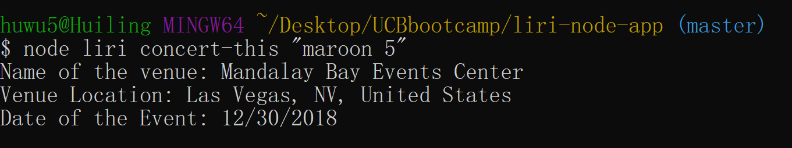
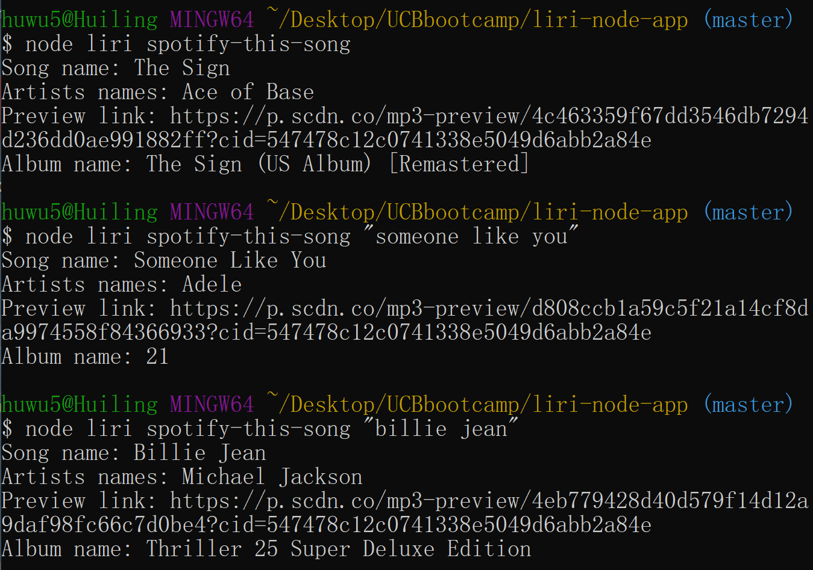
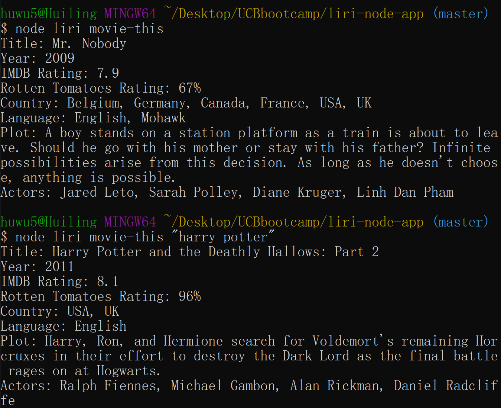
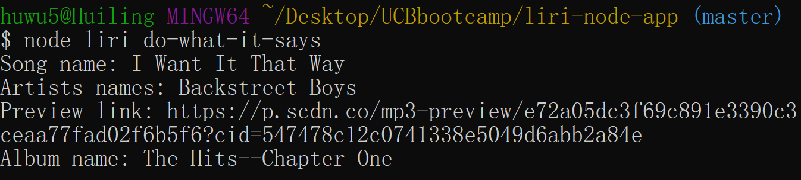

# liri-node-app

LIRI is a Language Interpretation and Recognition Interface. LIRI will be a command line node app that takes in parameters and gives you back data.

liri.js can take in one of the following commands:

* `concert-this`
* `spotify-this-song`
* `movie-this`
* `do-what-it-says`

### What Each Command Should Do

`node liri.js concert-this '<artist/band name here>'` then the following information about the event will show in the terminal:

* Name of the venue
* Venue location
* Date of the Event (use moment to format this as "MM/DD/YYYY")

`node liri.js spotify-this-song '<song name here>'` This will show the following information about the song in the terminal/bash window:

* Artist(s)
* The song's name
* A preview link of the song from Spotify
* The album that the song is from

If no song is provided then the program will default to "The Sign" by Ace of Base.

`node liri.js movie-this '<movie name here>'` This will output the following information to the terminal/bash window:

* Title of the movie.
* Year the movie came out.
* IMDB Rating of the movie.
* Rotten Tomatoes Rating of the movie.
* Country where the movie was produced.
* Language of the movie.
* Plot of the movie.
* Actors in the movie.

If the user doesn't type a movie in, the program will output data for the movie 'Mr. Nobody.'

`node liri.js do-what-it-says` LIRI will take the text inside of random.txt and then use it to call one of LIRI's commands

